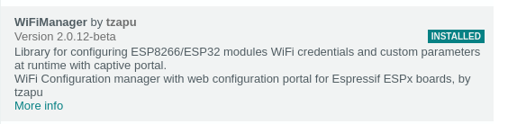

# siteauth-spike

**Hardware**

Adafruit HUZZAH32 – ESP32 Feather Board

https://www.adafruit.com/product/3405

ElecHouse PN532 module (v3)

https://www.elechouse.com/product/pn532-nfc-rfid-module-v4/

**Software**

Modified PN532 libraries from https://github.com/elechouse/PN532

Modified code is local in Arduino/libraries

WifiManager

